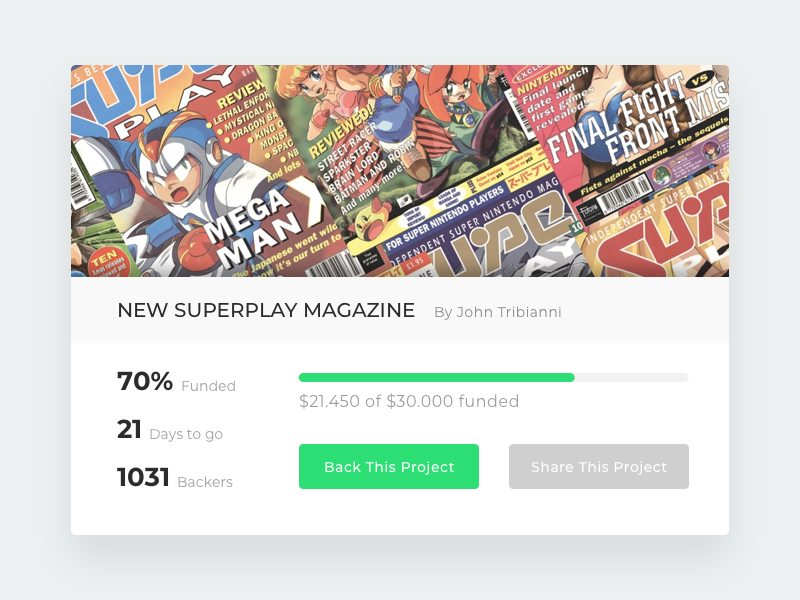

# Frontend Mentor - Crowdfunding Campaign Challenge

Design by: [Rodrigo Borges](http://rodrigob.com/)

Welcome! Thanks for checking out this front-end coding challenge. 

Your task is to build out the project to the design inside the `/design` folder.

The challenge does not require any JavaScript and **should not include any front-end frameworks/libraries**.

If you decide to push the project live, tweet **@frontendmentor** once you're finished with your URL in the tweet. I'd love to take a look at what you've built!

Feedback is always welcome, so if you have any regarding this challenge please email me at matt[at]frontendmentor[dot]io.

Have fun building!

## Styleguide

### Colours
- Primary: `rgb(44,222,115)`
- Body Background: `rgb(237,241,242)`

### Shades
- Lightest: `rgb(249,249,249)`
- Light: `rgb(241,241,241)`
- Mid: `rgb(207,207,207)`
- Dark: `rgb(155,155,155)`
- Darkest: `rgb(44,44,44)`

### Typography
#### Font Family
- [Montserrat](https://fonts.google.com/specimen/Montserrat)

#### Font Weights
- 400
- 500
- 700